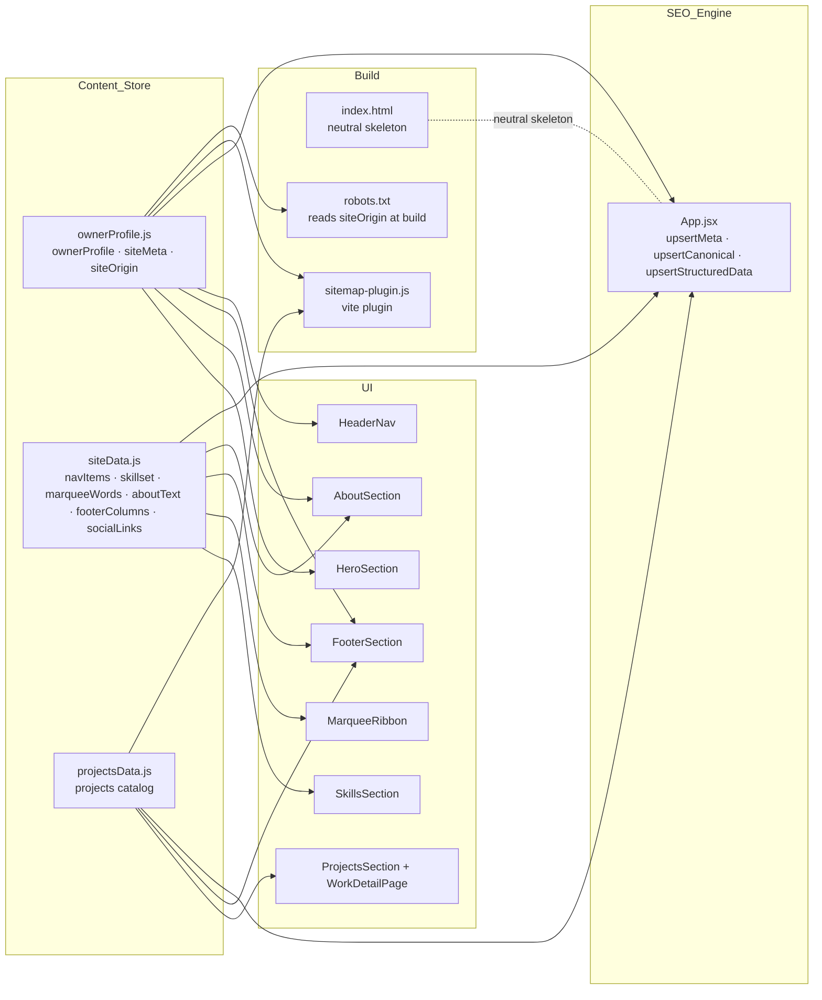
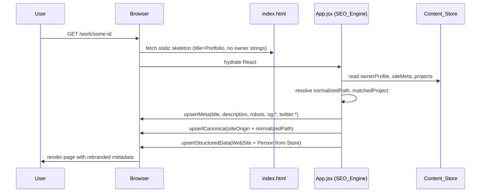

# Design Document

## Overview

The `portfolio-rebrand` feature replaces every trace of the previous owner in the existing React 19 + Vite 7 + React Router 7 + Tailwind CSS 4 portfolio with content, assets, and metadata belonging to the New_Owner, while preserving the current layout, motion, and routing behaviour.

The design achieves this by promoting the concept of a **Content_Store** — currently a loose bag of exports in `src/data/siteData.js` and `src/data/projectsData.js` — into a small, well-typed set of data modules that hold the single source of truth for identity, brand references, SEO defaults, project catalog, and social links. Every section component, the runtime SEO engine, the sitemap generator, and the static `index.html` payload derive their strings and URLs from this store. Removing the old owner then becomes a **replacement of data plus a swap of binary assets**, not a code rewrite.

Because the New_Owner has explicitly chosen "полностью замени всё" (full replacement, no residuals), the design treats the owner-identity fields as **presently unknown**: they default to a documented `TBD` placeholder that keeps the build green, satisfies the removal invariant, and makes the eventual identity fill-in a one-file change.

Key design decisions:

1. **Single source of truth per concern.** Owner identity, site metadata (title/description/OG defaults/site origin/locale), social links, and the project catalog each live in exactly one module. All UI, SEO logic, structured data, sitemap, and tests read from these modules.
2. **Runtime injection, not build-time templating.** The static `index.html` keeps a **neutral, owner-free skeleton** (title `Portfolio`, empty description, no baked-in `sameAs`) and the runtime SEO_Engine in `App.jsx` overwrites every meta tag, canonical link, and JSON-LD block on first render and on every navigation. This removes the need for a build-time HTML transformer and guarantees `index.html` alone contains no Previous_Owner_Reference.
3. **Sitemap is generated from the catalog at build time.** A tiny Vite plugin writes `dist/sitemap.xml` from `siteOrigin` and the exported `projects` array, so the sitemap can never drift from the runtime routes.
4. **Removal is enforced by a CI check.** A grep-based test in the Test_Suite scans the tracked source tree and the built `dist/` bundle for the forbidden substrings, so criterion 16.1 is verified automatically.

## Architecture

### Module dependency graph



### Request → render → metadata sequence



### Runtime layers

| Layer | Responsibility | Source file(s) |
| --- | --- | --- |
| Content_Store | Owner identity, site metadata, socials, project catalog. Zero UI, zero side effects. | `src/data/ownerProfile.js`, `src/data/siteData.js`, `src/data/projectsData.js` |
| Section components | Read Content_Store and render markup. No hardcoded identity strings. | `src/components/sections/*.jsx`, `src/components/layout/HeaderNav.jsx` |
| SEO_Engine | Per-route `<title>`, `<meta>`, `<link rel=canonical>`, JSON-LD upsert. Reads Content_Store only. | `src/App.jsx`, `src/lib/seo.js` (new) |
| Static skeleton | Owner-neutral `index.html` with placeholder title and no structured data. | `index.html` |
| Build outputs | Sitemap and robots.txt generated from Content_Store. Assets copied from `public/`. | `vite.config.js` (extend), `public/robots.txt`, `public/sitemap.xml` (generated) |

## Components and Interfaces

### New / refactored modules

#### `src/data/ownerProfile.js` (new)

Single source of truth for identity and site-level metadata.

```ts
// TypeScript-flavoured signatures for clarity — file is .js
export type OwnerProfile = {
  legalName: string      // e.g. "TBD"
  alias: string          // display alias, e.g. "TBD"
  handle: string         // profile-card handle without @, e.g. "tbd"
  role: string           // one-line role, e.g. "TBD Developer"
  aliasesForSchema: string[] // additional alternateName entries for Person JSON-LD
  location: {
    city: string         // "TBD"
    country: string      // "TBD"
    countryCode: string  // ISO-3166-1 alpha-2, "XX" when TBD
  }
  portraitSrc: string    // imported bundled asset URL (see PortraitAsset resolver)
  avatarSrc: string      // public path to avatar SVG, e.g. "/assets/demo/owner-avatar.svg"
  brandMarkSrc: string   // public path to symbol mark, e.g. "/brand/owner-mark.svg"
  ogImagePath: string    // public path (leading slash), e.g. "/assets/demo/owner-photo.jpg"
}

export type SiteMeta = {
  siteOrigin: string     // "https://example.com" — no trailing slash, MUST NOT equal https://xayrusha.uz
  defaultTitle: string   // 1..60 chars, e.g. "Portfolio | TBD"
  defaultDescription: string // 0..160 chars
  defaultOgImagePath: string // duplicates ownerProfile.ogImagePath for convenience
  lang: string           // BCP-47, e.g. "en"
  ogLocale: string       // underscore form derived from lang, e.g. "en_US"
}

export const ownerProfile: OwnerProfile
export const siteMeta: SiteMeta
export const siteOrigin: string // re-export of siteMeta.siteOrigin
```

Constraints enforced by data-integrity tests (see Testing Strategy):

- Every string field is non-empty (`TBD` is the accepted placeholder for owner-identity fields, never for `siteOrigin` or `defaultTitle`).
- `siteMeta.siteOrigin` matches `^https:\/\/(?!xayrusha\.uz)[a-z0-9.-]+$`.
- `siteMeta.defaultTitle.length` ∈ [1, 60].
- `siteMeta.defaultDescription.length` ∈ [0, 160].
- `siteMeta.ogLocale` starts with `siteMeta.lang.split('-')[0]` and follows `xx_XX` shape.

TBD-fallback strategy: if the user has not yet supplied real values, the module is initialised with the strings listed above (`"TBD"` for owner fields, `"XX"` for country code, a documented placeholder `siteOrigin` like `"https://portfolio.example"` for the origin, `"Portfolio"` for `defaultTitle`, `""` for `defaultDescription`). All UI branches must therefore tolerate `TBD` gracefully — no assertion, no runtime error.

#### `src/data/siteData.js` (refactored)

Keeps its current exports but removes every literal owner-identity string. `aboutText`, `footerColumns`, and `socialLinks` are re-authored so no member contains a Previous_Owner_Reference. `socialLinks.email` uses the New_Owner's mailto or `mailto:contact@{siteOrigin_host}` as a TBD fallback. The file no longer references `xayrusha`, `xayrullo`, or `XayrulloWeb` anywhere.

Additions:

```ts
export const aboutText: {
  heading: string
  headingHighlight: string
  paragraphs: string[]        // 1..N owner-authored paragraphs
  profileCaption: {
    title: string             // duplicates ownerProfile.alias — computed via re-export
    subtitle: string          // e.g. ownerProfile.role
  }
  brandBlockTagline: string   // Footer brand block paragraph (formerly hardcoded)
}
export const footerCopyright: (year: number) => string
  // returns `© ${year} ${ownerProfile.alias}` — the string used in FooterSection
```

`footerColumns.Projects` is now a **derived** value computed from `projects` at module load:

```js
const projectsColumn = {
  title: 'Projects',
  links: projects.map((p) => ({ label: p.name, href: p.href })),
}
```

This makes Requirement 7.4 an invariant instead of a piece of manual bookkeeping.

#### `src/data/projectsData.js` (repopulated)

Same schema as today, but seeded with the New_Owner's catalog. Every image import is expected to resolve to a file under `src/assets/{ProjectFolder}/` and every `githubUrl`/`liveUrl` must satisfy the property invariants below.

The old five entries (`filmzone`, `dream-go`, `finance`, `mchs`, `temp-monitoring`) are removed. The seed shipped with the rebrand contains **one placeholder project** so the app never has an empty Work page:

```js
export const projects = [
  {
    id: 'placeholder',
    name: 'Placeholder Project',
    href: '/work/placeholder',
    tagline: 'TBD — replace with your first case study.',
    projectType: 'TBD',
    role: 'TBD',
    liveUrl: null,
    githubUrl: null,
    collaborators: [{ name: ownerProfile.alias, role: 'Owner' }],
    description: 'TBD',
    problem: 'TBD',
    outcome: 'TBD',
    features: ['TBD'],
    deviceScreens: { desktop: placeholderDesktop, tablet: placeholderTablet, mobile: placeholderMobile },
    responsibilities: ['TBD'],
    process: ['TBD'],
    gallery: [
      { key: 'shot-01', title: 'Shot 01', src: placeholderShot1 },
      { key: 'shot-02', title: 'Shot 02', src: placeholderShot2 },
      { key: 'shot-03', title: 'Shot 03', src: placeholderShot3 },
    ],
    tags: ['TBD'],
  },
]
```

`placeholder*` imports resolve to files under `src/assets/Placeholder/*.webp` shipped as part of this rebrand.

Migration path when the New_Owner adds a real project: prepend the new entry, delete the placeholder entry, drop the media into a new `src/assets/{ProjectName}/` folder. The data-integrity property test (see below) will fail loudly if any field is missing.

#### `src/lib/seo.js` (new)

Extracted from the current `App.jsx` inline logic. Pure functions, unit-testable:

```ts
export function normalizePath(pathname: string): string
  // '/work/x/' -> '/work/x'; '/' -> '/'

export function resolveRouteSeo(pathname: string, deps: {
  siteMeta: SiteMeta
  ownerProfile: OwnerProfile
  projects: Project[]
}): {
  title: string
  description: string
  image: string          // absolute HTTPS URL
  url: string            // absolute canonical URL
  robots: 'index, follow, max-image-preview:large' | 'noindex, nofollow'
  isKnownPath: boolean
  matchedProject: Project | null
}

export function buildStructuredData(deps: {
  siteMeta: SiteMeta
  ownerProfile: OwnerProfile
  socialLinks: SocialLinks
}): object // schema.org @graph payload

export function upsertMeta(attribute: 'name' | 'property', key: string, content: string): void
export function upsertCanonical(url: string): void
export function upsertStructuredData(payload: object): void  // writes/updates <script id="ld-json">
```

Title composition rules (implementing Requirement 11):

- Home: `siteMeta.defaultTitle`, truncated to 60 chars.
- Work list: `` `Work | ${ownerProfile.alias}` ``, truncated to 60 chars.
- Work detail: `` `${project.name} | Work | ${ownerProfile.alias}` ``, truncated to 60 chars.
- Unknown / unmatched: `` `404 | Page not found | ${ownerProfile.alias}` ``, robots = `noindex, nofollow`.
- If `siteMeta` or any required subfield is missing at call time: `title = 'Portfolio'`, `description = ''`, `og:image` meta is removed rather than emitted.

Description resolution for work detail: `matchedProject.description || matchedProject.tagline || siteMeta.defaultDescription`, then truncated to 160 characters (`str.slice(0, 160)`).

### Refactored components

| Component | Current literal | Post-refactor binding |
| --- | --- | --- |
| `HeroSection.jsx` | `<h1>Xayrusha</h1>` | `<h1>{ownerProfile.alias}</h1>` |
| `HeroSection.jsx` | `I DESIGN AND BUILD WEB PRODUCTS THAT` | `{siteMeta.heroTagline}` (new field on `siteMeta`, defaults to that string but owner-authored) |
| `HeroSection.jsx` | `Based in Urgench,` / `Uzbekistan` | `{ownerProfile.location.city},` / `{ownerProfile.location.country}` |
| `HeroSection.jsx` | `FULL STACK DEV,` / `FRONTEND FOCUSED` | `{ownerProfile.role.split(',')[0]}` / `{ownerProfile.role.split(',')[1] ?? ''}` — or `siteMeta.roleTagline` (chosen approach: dedicated `heroRoleLines: [string, string]` on `siteMeta` to keep formatting flexible) |
| `AboutSection.jsx` | `<ProfileCard name="Xayrusha" handle="xayrusha" status="…" avatarUrl={myPhoto} />` | `name={ownerProfile.alias}` / `handle={ownerProfile.handle}` / `status={aboutText.profileCard.status}` / `avatarUrl={ownerProfile.portraitSrc}` |
| `AboutSection.jsx` | `<p>XAYRUSHA</p><p>Full Stack Development</p>` caption | `{aboutText.profileCaption.title}` / `{aboutText.profileCaption.subtitle}` |
| `AboutSection.jsx` | `import myPhoto from '../../assets/Me/image.webp'` | Portrait moves to `src/assets/owner/portrait.webp`, imported by `ownerProfile.js` and re-exposed as `ownerProfile.portraitSrc`. The `src/assets/Me/` folder is deleted. |
| `FooterSection.jsx` | `<h3>XAYRUSHA</h3>` | `<h3>{ownerProfile.alias.toUpperCase()}</h3>` |
| `FooterSection.jsx` | tagline paragraph literal | `{aboutText.brandBlockTagline}` |
| `FooterSection.jsx` | `© 2026 XAYRUSHA.` | `{footerCopyright(currentYear)}` where `currentYear = new Date().getFullYear()` |
| `FooterSection.jsx` | `'https://t.me/Xayrusha'` telegram fallback | The fallback branch is removed. When `socialLinks.telegram === '#'`, the Telegram submit handler shows a `statusText` explaining Telegram is not configured; no window is opened. |
| `HeaderNav.jsx` | `` | `` |
| `HeaderNav.jsx` | `<span>Xayrusha </span>` | `<span>{ownerProfile.alias} </span>` (trailing space preserved for visual balance) |

No prop-drilling changes are required — every component already imports from `src/data/siteData` today; those imports either continue to work (with siteData re-exporting from `ownerProfile`) or gain one extra import line for `ownerProfile`.

### SEO_Engine consolidation

Requirement 11.6 requires **a single Content_Store entry** to be the source of the default title, description, and OG image. Design:

1. `siteMeta.defaultTitle`, `siteMeta.defaultDescription`, `siteMeta.defaultOgImagePath` are the only definitions of these values. Grep-based CI check: no other tracked file may contain the string literals of these values (except the module itself and this design/spec).
2. `App.jsx` deletes its local `SITE_URL` and `DEFAULT_SEO` constants and imports `siteMeta`, `ownerProfile`, `projects`, and `resolveRouteSeo` from the store.
3. The static `index.html` is stripped to a neutral skeleton (title `Portfolio`, no description, no OG, no Twitter, no `<link rel="canonical">`, no `<script type="application/ld+json">`). A **runtime bootstrap** in `main.jsx` (or `App.jsx`'s first `useEffect`) immediately populates them from `siteMeta` on mount, so the pre-hydration static payload never contains owner data and the post-hydration DOM does.
4. `og:site_name` becomes `ownerProfile.alias`; `og:locale` becomes `siteMeta.ogLocale`; `og:type` remains `website`.

Trade-off: search crawlers that read the pre-hydration HTML (older bots) will see `Portfolio` as the title. Modern crawlers (Googlebot, Bingbot, Twitterbot, Slackbot) render JavaScript and see the hydrated metadata. This is an acceptable trade for the removal invariant; the sitemap, robots, and JSON-LD carry the canonical identity for crawlers that need it. If a build-time replacement is later desired, the Vite plugin described below can be extended to also rewrite `<title>` and inject the JSON-LD block from `siteMeta` and `ownerProfile`.

### Structured_Data strategy

`upsertStructuredData` writes a `<script type="application/ld+json" id="ld-json">` element into `<head>` on first `App` mount and updates it on route change (only if content actually differs, to avoid layout thrash).

Shape:

```json
{
  "@context": "https://schema.org",
  "@graph": [
    {
      "@type": "WebSite",
      "@id": "{siteOrigin}/#website",
      "url": "{siteOrigin}/",
      "name": "{ownerProfile.alias}",
      "alternateName": "{ownerProfile.legalName}"
    },
    {
      "@type": "Person",
      "@id": "{siteOrigin}/#person",
      "name": "{ownerProfile.legalName}",
      "alternateName": ["{ownerProfile.alias}", ...ownerProfile.aliasesForSchema],
      "url": "{siteOrigin}/",
      "image": "{siteOrigin}{ownerProfile.ogImagePath}",
      "jobTitle": ["{ownerProfile.role}"],
      "address": { "@type": "PostalAddress", "addressCountry": "{ownerProfile.location.countryCode}" },
      "sameAs": derivedSameAs()
    }
  ]
}
```

`derivedSameAs()` iterates over `socialLinks`, keeps only string values that (a) start with `https://` and (b) are not literally `#`, and (c) do not match the Previous_Owner_Reference blacklist. This is exactly the filter that Requirement 12.8 demands. The email entry (`mailto:…`) is excluded — schema.org `sameAs` is URL-only.

### Sitemap and robots strategy

**Sitemap generation** happens at build time via a small Vite plugin:

```js
// vite-plugin-sitemap.js
import { projects } from './src/data/projectsData.js'
import { siteMeta } from './src/data/ownerProfile.js'

export function sitemapPlugin() {
  return {
    name: 'portfolio-sitemap',
    apply: 'build',
    generateBundle() {
      const urls = [
        `${siteMeta.siteOrigin}/`,
        `${siteMeta.siteOrigin}/work`,
        ...projects.map((p) => `${siteMeta.siteOrigin}/work/${p.id}`),
      ]
      const xml = renderSitemap(urls)
      this.emitFile({ type: 'asset', fileName: 'sitemap.xml', source: xml })
    },
  }
}
```

The existing `public/sitemap.xml` is deleted; Vite will produce `dist/sitemap.xml` from the plugin. Dev mode does not need a sitemap.

**Robots** stays as a small static file but is rewritten so its `Sitemap:` line matches `siteMeta.siteOrigin`. Because `robots.txt` lives under `public/` and Vite copies it verbatim, we cannot substitute `siteOrigin` at build time from `public/`. The design accepts either of two options; the recommended one is:

- **Recommended:** move `robots.txt` out of `public/`, generate it from the same Vite plugin (`this.emitFile({ fileName: 'robots.txt', source: … })`), keeping a single knob (`siteMeta.siteOrigin`) for both artifacts.

The alternative — keeping `public/robots.txt` as a manually-updated file — is rejected because it duplicates the origin and violates Requirement 10.1 ("exactly one Site_Origin constant").

### Brand and media asset pipeline

Folder layout after the rebrand:

```
public/
  favicon.svg                          # New_Owner brand mark, SVG
  brand/
    owner-mark.svg                     # symbol mark (was xayrusha-mark.svg)
    owner-lockup.svg                   # wordmark lockup (was xayrusha-lockup.svg)
  assets/
    demo/
      grain.svg                        # unchanged
      iconpattern.svg                  # unchanged
      owner-avatar.svg                 # ProfileCard avatar (was xayrusha-avatar.svg)
      owner-photo.jpg                  # OG preview image (was xayrusha-photo.jpg)
src/
  assets/
    owner/
      portrait.webp                    # About/Profile portrait (was Me/image.webp)
    Placeholder/
      desktop.webp
      tablet.webp
      mobile.webp
      shot-01.webp
      shot-02.webp
      shot-03.webp
    mp3/8-milya.mp3                    # unchanged (unused, but preserved)
    # NOTE: FilmZone/, Dream Go/, Finance/, Mchs/, TempMonitoring/, and Me/ are DELETED
```

Naming rule: filenames under `public/brand/`, `public/assets/demo/`, and `src/assets/` that used to embed the previous owner alias are renamed to use the literal `owner` (generic, TBD-safe). When the New_Owner picks a real alias, a later pass may rename to that alias in kebab-case; the design does not couple the alias string to the filename.

Placeholder assets: `public/brand/owner-mark.svg`, `public/brand/owner-lockup.svg`, `public/favicon.svg`, `public/assets/demo/owner-avatar.svg`, `public/assets/demo/owner-photo.jpg`, `src/assets/owner/portrait.webp`, and the six `src/assets/Placeholder/*.webp` files are shipped as neutral art (silhouette / gradient / abstract shape) generated as part of this rebrand. This satisfies Requirement 9.5.

### Project_Catalog schema (formalised)

```ts
type Project = {
  id: string                  // kebab-case, unique across catalog, matches trailing segment of href
  name: string                // non-empty
  emoji?: string
  icon?: string
  color?: string
  href: string                // `/work/${id}`
  cta?: string
  tagline: string             // non-empty
  timeline?: string
  projectType: string         // non-empty
  role: string                // non-empty
  liveUrl: string | null      // if string, must be absolute HTTPS, not on Previous_Owner_Reference blacklist
  githubUrl: string | null    // same rule
  collaborators: Array<{ name: string; role: string }>
  description: string         // non-empty
  problem: string             // non-empty
  outcome: string             // non-empty
  features: string[]
  deviceScreens: {
    desktop: string           // imported .webp URL
    tablet: string
    mobile: string
  }
  responsibilities?: string[]
  process?: string[]
  gallery: Array<{ key: string; title: string; src: string }> // length ≥ 3
  tags: string[]              // length ≥ 1
}
```

Removal and addition rules:

- Removal of a stale entry: delete the object, delete the corresponding `import … from '../assets/OldFolder/*.webp'` block, delete the asset folder. The footer `Projects` column and the sitemap update automatically (derived exports).
- Addition of a new entry: import media, add the object, ensure `id` is unique. The property test enforces every field constraint on save/CI.

### Configuration surface

`.env` and `.env.example` both declare exactly one variable:

```dotenv
VITE_GITHUB_USERNAME=
```

Behaviour for unset/whitespace values: the GitHub widget reads `import.meta.env.VITE_GITHUB_USERNAME`, trims it, and if the trimmed value is empty (unset, `""`, or whitespace) it returns `null` from the widget component (React `return null` — unmount) instead of throwing. This satisfies Requirement 14.4.

The `.env` file is not committed for production credentials, but this repo already tracks it. The design keeps `.env` tracked with the empty value shown above (no leaked secret). Requirement 14.5 becomes an invariant: the value SHALL NOT equal `XayrulloWeb`. The removal-scan test enforces this by scanning tracked files for `XayrulloWeb`.

The README updates its "Environment variables" section to document the new variable and its empty default. The New_Owner fills their GitHub username locally.

### Removal / cleanup design

The cleanup guarantee has three layers:

1. **Source-level.** All owner-identity strings are moved to `ownerProfile.js` / `siteMeta`. UI files import instead of hardcoding. This is enforced by construction.
2. **Asset-level.** Every file under `public/` and `src/assets/` whose name embedded the previous alias is renamed or deleted (see pipeline above).
3. **CI-level.** A property-based test (see below) scans:
   - The tracked source tree, excluding this spec's own `.kiro/specs/portfolio-rebrand/*.md` files (which discuss the forbidden strings by necessity) and the git-ignored `node_modules/`, `dist/`, `.git/`.
   - The built `dist/` bundle after `vite build`.
   
   for the case-insensitive substrings `xayrusha`, `raxmonberganov`, `xayrulloweb`, `xayrullo01_02`, `xayrulloweb@gmail.com`, `xayrusha.uz`. Any match fails the test.

Exemption for Requirement 16.5 (retained-project attribution): if a project intentionally credits the Previous_Owner_Reference in its `collaborators` array, the scan test provides a documented allowlist mechanism (an array in the test file itself listing the exact substrings to exempt in bundled JS). For the initial rebrand, the placeholder catalog contains no such attribution and the allowlist is empty.

## Data Models

### Owner profile object shape

```ts
type SocialLinks = {
  github: string     // 'https://…' | '#'
  linkedin: string   // 'https://…' | '#'
  twitter: string    // 'https://…' | '#'
  telegram: string   // 'https://…' | '#'
  instagram: string  // 'https://…' | '#'
  email: string      // 'mailto:…'
}
```

### Content_Store export map (post-refactor)

| Import path | Named exports |
| --- | --- |
| `src/data/ownerProfile.js` | `ownerProfile`, `siteMeta`, `siteOrigin` |
| `src/data/siteData.js` | `navItems`, `skillset`, `testimonials`, `marqueeWords`, `blogPosts`, `aboutText`, `footerColumns`, `footerCopyright`, `socialLinks`, `projects` (re-export) |
| `src/data/projectsData.js` | `projects` |
| `src/lib/seo.js` | `normalizePath`, `resolveRouteSeo`, `buildStructuredData`, `upsertMeta`, `upsertCanonical`, `upsertStructuredData` |

### Requirements → design elements mapping

| Requirement | Design element |
| --- | --- |
| 1.1–1.4 Owner identity central | `src/data/ownerProfile.js` with `OwnerProfile` shape and `TBD` fallbacks |
| 2.1–2.4 Hero personalisation | HeroSection rewritten to bind alias / roleLines / location from `ownerProfile` + `siteMeta` |
| 3.1–3.5 About replacement | `aboutText` extended with `profileCaption` and `brandBlockTagline`; AboutSection binds ProfileCard from `ownerProfile` |
| 4.1–4.5 Skills / Marquee | `skillset` and `marqueeWords` reauthored in `siteData.js`; count invariant 6–16 checked by tests |
| 5.1–5.8 Project catalog | Project schema formalised; placeholder seed shipped; old asset folders deleted |
| 6.1–6.7 Social links | `socialLinks` reauthored; `#` fallback tolerated; Telegram fallback in Footer switched to inline status |
| 7.1–7.4 Footer | `aboutText.brandBlockTagline`, `footerCopyright()`, derived `Projects` column |
| 8.1–8.3 Header | HeaderNav reads `ownerProfile.brandMarkSrc` and `ownerProfile.alias`; asset renamed to `owner-mark.svg` |
| 9.1–9.5 Assets | Asset pipeline section; placeholder files shipped |
| 10.1–10.7 Site origin | `siteMeta.siteOrigin` single constant; `resolveRouteSeo` builds every absolute URL; sitemap+robots generated from the same knob |
| 11.1–11.7 Per-route SEO | `resolveRouteSeo` in `src/lib/seo.js` with title composition and truncation rules |
| 12.1–12.8 Structured data | `buildStructuredData` + `upsertStructuredData`; `sameAs` filter |
| 13.1–13.5 Sitemap/robots | Vite plugin generates both from `projects` + `siteMeta.siteOrigin` |
| 14.1–14.5 GitHub widget | `.env` scaffolding empty; widget unmounts when unset |
| 15.1–15.3 Locale | `siteMeta.lang` drives `<html lang>` (set at bootstrap) and `siteMeta.ogLocale` drives `og:locale` |
| 16.1–16.5 Removal | CI grep test; asset rename/delete; identity moved out of literals |
| 17.1–17.4 Docs | README rewritten to reference `siteMeta.siteOrigin` and `VITE_GITHUB_USERNAME` |
| 18.1–18.4 Tests | New data-integrity tests, updated HeroSection test |
| 19.1–19.4 Continuity | No changes to motion / routing / landmarks |
| 20.1–20.3 Palette optional | Out of scope for this rebrand (only if the New_Owner requests) |
| 21.1–21.4 Build readiness | `npm run build` + `npm run lint` + preview smoke tests in Testing Strategy |
